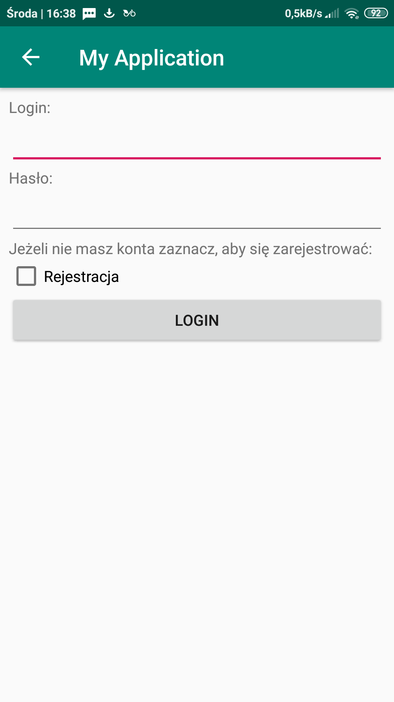

# Sprawozdanie

## Opis

Aplikacja, którą stworzyłem jest prostą grą typu idle, czyli polegającą na zbieraniu punktów. Gracz uzyskuje jakąś liczbę punktów za każde kliknięcie i może później poświęcić część posiadanych punktów w zamian za zwięszkenie liczby otrzymywanych za każde kliknięcie.

Gracz może się zalogować lub zarejestrować (konta są trzymane na moim serwere na Heroku).

Gracz może obejrzeć aktualną listę najlepszych wyników w Activity High Score.

## SharedPreferences

Login, hasło, aktualny wynik, aktualny koszt upgrade'u, oraz aktualna wartosć dodawana do wyniku po kliknięciu są trzymane w SharedPreference.

## Async Task

## SQLite

High Score są zapisywane w bazie danych w momencie pobrania.

## HTTP POST

Logownie, rejestracja, oraz upload punktów jest realizowany asynchronicznym POSTem.

## HTTP GET

High Score są pobierane asynchronicznym GETem.

## Toast

Toast pojawia się w przypadku nieudanego logowania.

## Screeny

!
!
!
!